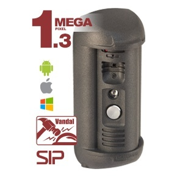

# BEWARD DS06M for Scrypted

[Русский](README.md) · [English](README.en.md)



This plugin integrates the BEWARD DS06M door station with [Scrypted](https://www.scrypted.app/). Official documentation is available at [docs.scrypted.app](https://docs.scrypted.app/).

It exposes the DS06M as a `Doorbell`. Video and incoming audio can come directly from the DS06M RTSP stream or from another Scrypted camera, while talkback audio is sent to the panel over SIP. The gate lock is included in the same HomeKit accessory.

## Features

- RTSP video and incoming audio;
- incoming SIP calls;
- HomeKit Secure Video motion events from the source camera, with a doorbell press used as a fallback recording trigger;
- HomeKit → Scrypted → DS06M talkback using PCMU/G.711U at 8 kHz;
- delayed SIP answer until speech is detected, so merely opening the camera does not stop the doorbell from ringing;
- HTTP gate relay control;
- automatic HomeKit lock state reset without sending a second HTTP request;
- snapshots from the direct RTSP stream or from the selected source camera;
- default manufacturer `BEWARD`, model `DS06M`, name `Домофон`, and room `Улица`.

## Requirements

- a working Scrypted installation;
- Node.js and npm;
- a BEWARD DS06M with RTSP and SIP enabled;
- network access between Scrypted and the panel over SIP, RTP, RTSP, and HTTP.

## Installation

```bash
git clone https://github.com/Sergbmw/scrypted-beward-ds06m.git
cd scrypted-beward-ds06m
npm install
npm run build
npm run scrypted-deploy -- <SCRYPTED_HOST>
```

The Scrypted CLI will request the server address and credentials. Never store a password or token in the repository.

## Scrypted settings

| Setting | Example | Purpose |
| --- | --- | --- |
| `Source Camera ID` | Scrypted camera ID | Optional external source for video, audio, snapshots, and motion events; leave empty for direct RTSP |
| `RTSP Stream URL` | `rtsp://<DOORBELL_HOST>:554/av0_0` | Direct DS06M stream used when `Source Camera ID` is empty |
| `SIP From: URI` | `scrypted@<SCRYPTED_HOST>:5060` | Local SIP listener address |
| `SIP To: URI` | `doorbell@<DOORBELL_HOST>:5060` | Door station SIP address |
| `Open Relay URL` | `http://<USER>:<PASSWORD>@<DOORBELL_HOST>/cgi-bin/alarmout_cgi?channel=0&Output=0&Status=1` | Gate relay command |
| `Auto Lock Delay` | `5` | Delay before returning the HomeKit lock state to locked |

The relay URL is stored in Scrypted device storage. Do not include a real URL or credentials in source files, issues, or build logs.

For a single `Doorbell` device, configure `RTSP Stream URL` and leave `Source Camera ID` empty. Keep a separate ONVIF/RTSP camera only for features unavailable from the direct stream, such as continuous ONVIF motion detection.

## DS06M SIP configuration

For a direct connection without a SIP server:

1. Enable the SIP account on the panel.
2. Disable SIP server registration.
3. Configure the Scrypted host as the call destination.
4. Select `G.711U`, `8 kHz`, and `RFC2833` DTMF.
5. Enable audio and incoming calls.
6. Disable silent answer mode.
7. Leave the audio activation DTMF command empty.

The SIP signaling UDP port and dynamic RTP UDP ports must be reachable between both devices.

## Talkback behavior

HomeKit may start sending talkback audio as soon as live view opens. The plugin analyzes the PCMU level and accepts a pending SIP call only after stable speech is detected. After answering, it enables the DS06M audio output and repeats that command when RTP starts to account for panel firmware behavior.

## HomeKit Secure Video

The doorbell exposes the `MotionSensor` interface required by HomeKit Secure Video. Motion from the selected source camera is forwarded to HomeKit. A DS06M button press also creates a 15-second motion event so HomeKit can record the call without a separate detector.

Use a standalone HomeKit accessory for an HKSV camera:

1. Open the `Домофон` device in Scrypted.
2. Enable `Standalone Accessory Mode` in the `HomeKit` section.
3. Reload the HomeKit plugin in Scrypted.
4. Scan the QR code from the `HomeKit` section with an iPhone or iPad and add the doorbell to Apple Home.
5. Open the doorbell settings, select Recording Options, and choose Stream & Allow Recording.

A camera inside the shared HomeKit Bridge may fail when Apple Home saves the recording mode. Switching to `Standalone Accessory Mode` removes the doorbell from the old bridge, so it must be paired with Apple Home once more. HKSV requires an Apple TV or HomePod home hub and an eligible iCloud+ plan.

## Scrypted and plugin updates

- **Scrypted server updates.** Scrypted backups contain settings and installed plugins. A server update should keep the device and its configuration, but download a backup from `Settings → Backup` before a major release.
- **Official plugin updates.** HomeKit, ONVIF, Snapshot, and Prebuffer update independently. They do not replace the BEWARD DS06M code, but a new version may change video, audio, or HomeKit processing. Verify live video, incoming audio, and talkback after updating them.
- **BEWARD DS06M updates.** This plugin is installed from a local build and is not updated automatically with Scrypted. Pull the new repository version, run `npm install`, `npm run build`, and deploy it again with `npm run scrypted-deploy -- <SCRYPTED_HOST>`.
- **Settings retention.** Deploying a new build with the same package ID replaces the code and keeps the device settings. Changing the package ID creates a separate plugin in Scrypted and requires new configuration.
- **Interface changes.** If a release adds `MotionSensor`, `Lock`, or another interface, reload BEWARD DS06M and HomeKit. Pairing is required again only when moving between the HomeKit Bridge and `Standalone Accessory Mode`, or after resetting pairing data.
- **Post-update validation.** Place a real call and verify video, incoming audio, talkback, ringing duration, gate opening, and HKSV recording. A green plugin status alone does not prove that SIP/RTP works on the door station.

Official backup and restore instructions: [Backup and Restore](https://docs.scrypted.app/maintenance/migration.html).

## Security

- The repository contains no addresses, usernames, passwords, or tokens from a specific installation.
- Credentials are read only from Scrypted device settings.
- Use a dedicated panel account with the minimum required permissions where possible.
- Remove RTSP URLs, SIP addresses, and authorization headers before publishing logs.

## Build

```bash
npm install
npm run build
```

The plugin archive is created at `out/plugin.zip`. The `out` directory is not committed.

## License

MIT. See [LICENSE](LICENSE).
