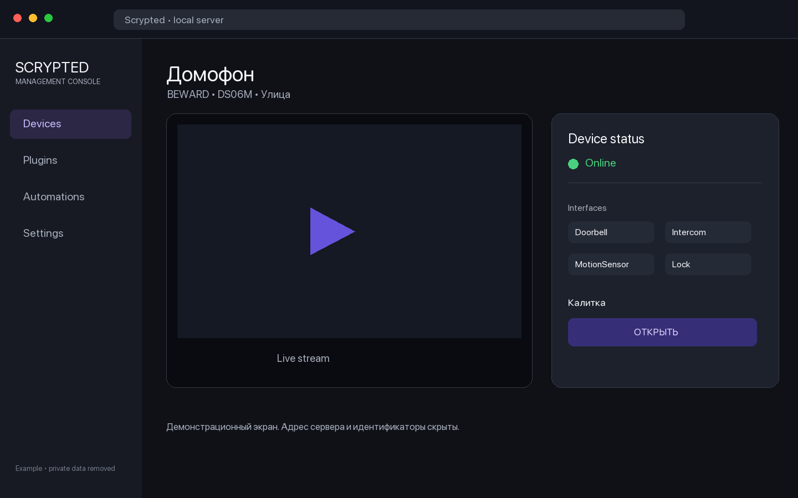
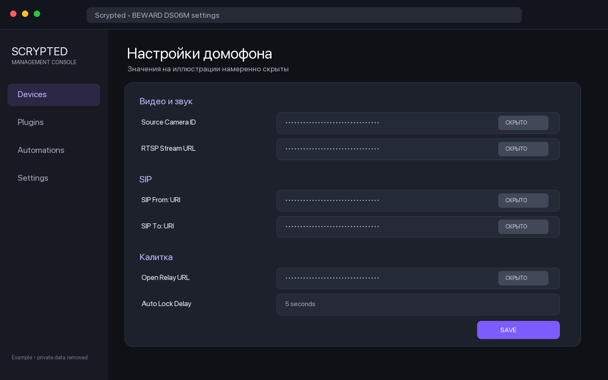

# BEWARD DS06M для Scrypted

[Русский](README.md) · [English](README.en.md)

Плагин предназначен для платформы [Scrypted](https://www.scrypted.app/). Официальная документация: [docs.scrypted.app](https://docs.scrypted.app/).

Плагин добавляет домофон BEWARD DS06M в Scrypted как устройство типа `Doorbell`. Видео и входящий звук берутся из рабочей RTSP/ONVIF-камеры, а обратный звук передаётся в панель по SIP. В HomeKit домофон отображается вместе с замком калитки.

## Возможности

- видео и входящий звук из RTSP-потока;
- входящий вызов по SIP;
- HomeKit Secure Video: событие движения передаётся от исходной камеры, а нажатие кнопки вызова используется как резервный триггер записи;
- обратный звук HomeKit → Scrypted → DS06M в формате PCMU/G.711U, 8 кГц;
- ответ на SIP-вызов только после обнаружения речи, поэтому открытие камеры само по себе не прекращает звонок;
- управление реле калитки по HTTP;
- автоматический возврат состояния замка в `Закрыто` без повторного HTTP-запроса;
- снимки через выбранную исходную камеру;
- производитель `BEWARD`, модель `DS06M`, имя `Домофон`, комната `Улица`.

## Требования

- работающий Scrypted;
- Node.js и npm;
- BEWARD DS06M с включёнными RTSP и SIP;
- сетевой доступ между Scrypted и домофоном по SIP, RTP, RTSP и HTTP.

## Установка

```bash
git clone https://github.com/Sergbmw/scrypted-beward-ds06m.git
cd scrypted-beward-ds06m
npm install
npm run build
npm run scrypted-deploy -- <SCRYPTED_HOST>
```

CLI Scrypted запросит адрес и данные входа. Не сохраняйте пароль или токен в репозитории.

## Скриншоты настройки

Ниже показаны обезличенные примеры интерфейса. Адрес сервера, идентификаторы устройств, RTSP/SIP-адреса и данные доступа скрыты.





## Настройка Scrypted

Создайте устройство в плагине и заполните параметры:

| Параметр | Пример | Назначение |
| --- | --- | --- |
| `Source Camera ID` | идентификатор камеры в Scrypted | Источник видео, входящего звука и снимков |
| `RTSP Stream URL` | `rtsp://<DOORBELL_HOST>:554/av0_0` | Прямой поток DS06M, если не используется отдельная исходная камера |
| `SIP From: URI` | `scrypted@<SCRYPTED_HOST>:5060` | Локальный адрес SIP-приёмника |
| `SIP To: URI` | `doorbell@<DOORBELL_HOST>:5060` | SIP-адрес панели |
| `Open Relay URL` | `http://<USER>:<PASSWORD>@<DOORBELL_HOST>/cgi-bin/alarmout_cgi?channel=0&Output=0&Status=1` | Команда открытия калитки |
| `Auto Lock Delay` | `5` | Через сколько секунд вернуть состояние замка в `Закрыто` |

`Open Relay URL` хранится в настройках Scrypted. Не добавляйте реальный URL с учётными данными в исходники, README, issue или журнал сборки.

## Настройка SIP в DS06M

Для прямого соединения без SIP-сервера:

1. Включите SIP-аккаунт панели.
2. Отключите регистрацию на SIP-сервере.
3. Укажите адрес Scrypted как получателя вызова.
4. Выберите `G.711U`, частоту `8 кГц` и режим DTMF `RFC2833`.
5. Включите звук и приём входящих вызовов.
6. Отключите режим «Ответ без звука».
7. Оставьте поле DTMF-команды включения звука пустым.

SIP использует UDP-порт сигнализации и динамические UDP-порты RTP. Они должны быть доступны между устройствами.

## Работа обратного звука

HomeKit может начать отправлять обратные аудиопакеты сразу после открытия просмотра. Плагин анализирует уровень PCMU и принимает ожидающий SIP-вызов только после устойчивого речевого сигнала. После ответа плагин включает аудиовыход DS06M и повторяет команду после начала RTP, чтобы учитывать особенности прошивки панели.

## HomeKit Secure Video

Домофон объявляет интерфейс `MotionSensor`, который необходим HomeKit Secure Video. Если выбранная в `Source Camera ID` камера поддерживает обнаружение движения, плагин передаёт её состояние в HomeKit. Вызов с кнопки DS06M также создаёт 15-секундное событие движения, чтобы HomeKit сохранил запись звонка даже без отдельного детектора.

После установки или обновления плагина перезагрузите HomeKit-плагин в Scrypted. В приложении «Дом» откройте настройки домофона → «Параметры записи» и выберите «Трансляция и запись». Для HKSV нужен домашний центр Apple TV или HomePod и подходящий тариф iCloud+.

## Безопасность

- В репозитории нет адресов, логинов, паролей и токенов конкретной установки.
- Учётные данные читаются только из настроек устройства в Scrypted.
- Для HTTP-доступа к панели рекомендуется отдельная учётная запись с минимально необходимыми правами.
- Перед публикацией журналов удаляйте RTSP-URL, SIP-адреса и HTTP-заголовки авторизации.

## Обновления Scrypted и плагинов

- **Обновление сервера Scrypted.** Настройки и установленные плагины входят в резервную копию Scrypted. Обновление сервера не должно удалять устройство или его параметры, но перед крупной версией рекомендуется скачать резервную копию через `Settings → Backup`.
- **Обновление официальных плагинов.** HomeKit, ONVIF, Snapshot и Prebuffer обновляются отдельно. Они не заменяют код BEWARD DS06M, однако новая версия может изменить обработку видео, звука или HomeKit. После обновления проверьте живое видео, входящий звук и разговор.
- **Обновление BEWARD DS06M.** Этот плагин установлен из локальной сборки и автоматически вместе со Scrypted не обновляется. Получите новую версию репозитория, выполните `npm install`, `npm run build` и повторите `npm run scrypted-deploy -- <SCRYPTED_HOST>`.
- **Сохранение настроек.** Повторное развёртывание с тем же package ID обновляет код и сохраняет настройки устройства. Изменение package ID создаст для Scrypted другой плагин и потребует новой настройки.
- **Изменение интерфейсов.** Если версия добавляет `MotionSensor`, `Lock` или другой интерфейс, перезагрузите BEWARD DS06M и HomeKit. Удалять аксессуар из приложения «Дом» обычно не требуется.
- **Проверка после обновления.** Выполните реальный вызов и проверьте видео, входящий звук, обратную речь, продолжительность звонка, открытие калитки и запись HKSV. Зелёный статус плагина сам по себе не подтверждает работу SIP/RTP на домофоне.

Официальная инструкция по резервному копированию и восстановлению: [Backup and Restore](https://docs.scrypted.app/maintenance/migration.html).

## Сборка

```bash
npm install
npm run build
```

Готовый архив создаётся в `out/plugin.zip`. Каталог `out` не хранится в Git.

## Лицензия

MIT. См. [LICENSE](LICENSE).
